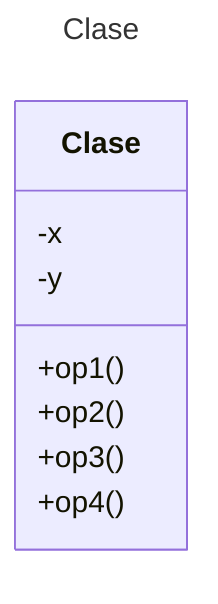

# Restaurante - Diagramas de Clases

Ejercicio de diagrama de clases utilizando **Mermaid**

## Instrucciones
Leer la sección **Planteamiento de ejercicio** y diseñar el diagrama de clases en la sección **Diagrama de clases**.

## Planteamiento de ejercicio
Restaurante
En un restaurante, cada vez que lo visita un cliente (se considera cliente al conjunto de personas que ocupan una mesa) se le abre una orden de servicio. En esta se registra la mesa en la que se sienta y la cantidad de comensales en la misma. En la orden de servicio se registra el mesero asignado y la hora de llegada. Cada mesa tiene un número identificador, una capacidad y una ubicación.

El cliente puede ordenar platillos y bebidas. Los platillos tienen un nombre, un precio y un tiempo de preparación. Las bebidas tienen un nombre, un precio, un volumen y una marca (cuando se requiera).

El pago de la orden de servicio está compuesto por tres importes, un subtotal (que es lo consumido por el cliente), la propina y los impuestos por la venta realizada y se debe calcular el total del pago. La orden se puede pagar en efectivo o a crédito. Si es en efectivo se requiere saber la cantidad recibida y si es a crédito se requiere saber el número de tarjeta de crédito, el tipo de tarjeta y calcular el cargo por el uso de la tarjeta.

## Diagrama de clases
[Editor en línea](https://mermaid.live/)

[Referencia-Mermaid](https://mermaid.js.org/syntax/classDiagram.html)

## Comandos Git-Cambios y envío a Autograding

### Por cada cambio importante que haga, actualice su historia usando los comandos:
```
git add .
git commit -m "Descripción del cambio"
```
### Envíe sus actualizaciones a GitHub para Autograding con el comando:
```
git push origin main
```
## Fin de Archivo
